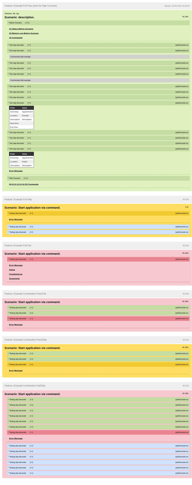
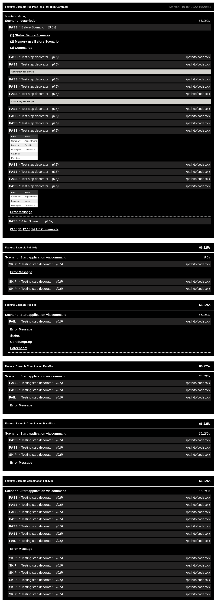

# behave-html-pretty-formatter - readme still TODO

	<h3 align="center">HTML Pretty formatter for Behave</h3>
	

		 
		<small>Inspired by <a href="https://github.com/Hargne/jest-html-reporter">jest-html-reporter</a></small>
		 
		<small>Project used to generate the html is <a href="https://github.com/Knio/dominate">dominate</a></small>
		 
        <h4 align="center">HTML Pretty</h4>
		

			
		

        <h4 align="center">HTML Pretty High Contrast</h4>
		

			
		

		 
		 
	

# INSTALLATION
# USAGE
# HACKING
