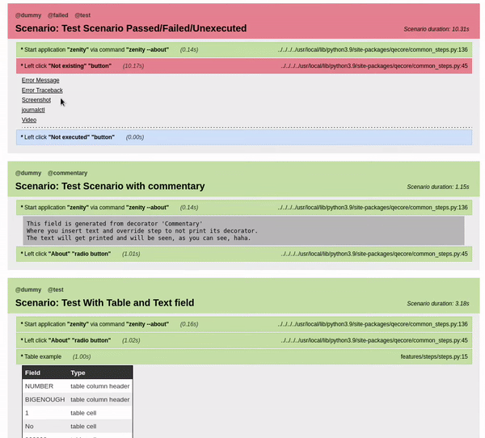
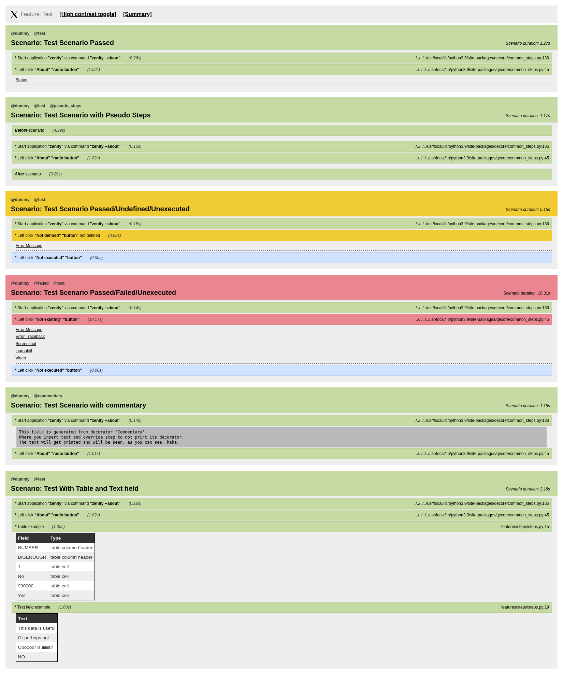
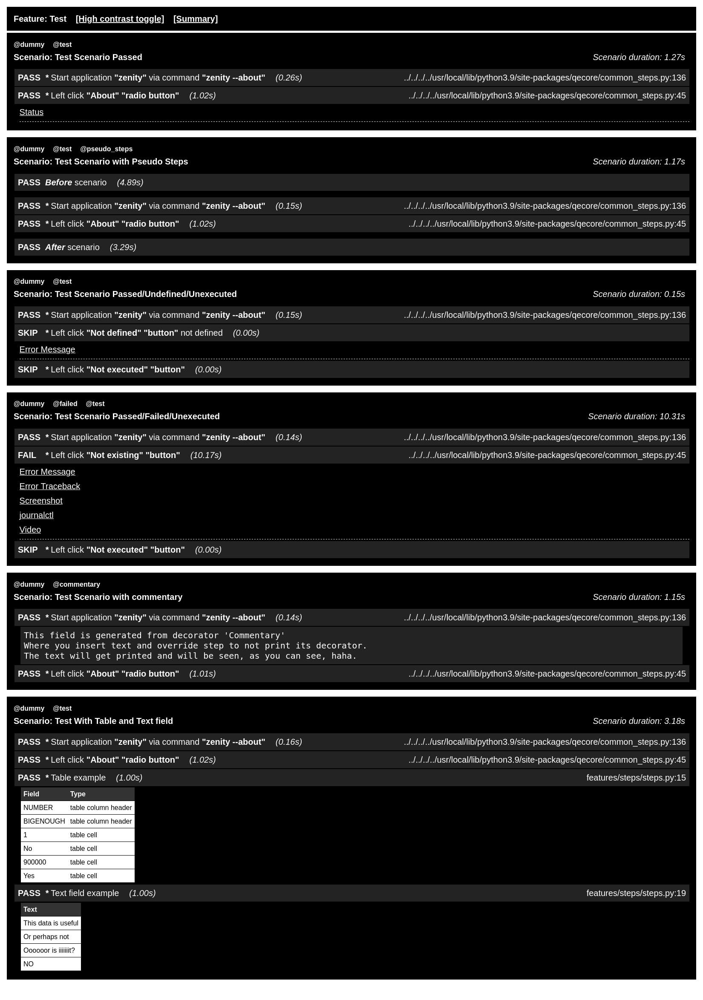
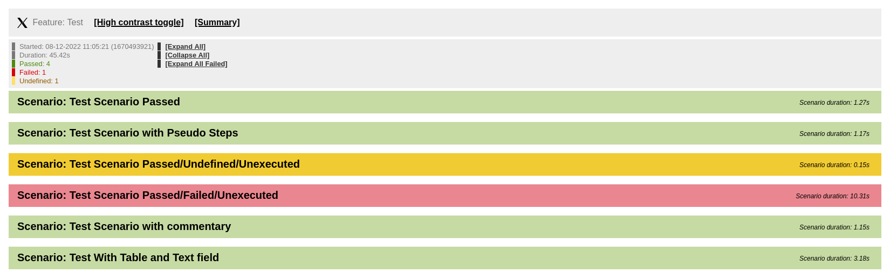
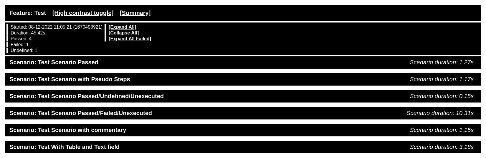

# HTML Pretty formatter for Behave

- Inspired by [jest-html-reporter](https://github.com/Hargne/jest-html-reporter)
- Using project [dominate](https://github.com/Knio/dominate) to generate the page

## Installation

```shell
python3 -m pip install behave-html-pretty-formatter
```


## Usage

To use it with behave create `behave.ini` file in project folder (or in home) with
following content:

```ini
# -- FILE: behave.ini
# Define ALIAS for PrettyHTMLFormatter.
[behave.formatters]
html-pretty = behave_html_pretty_formatter:PrettyHTMLFormatter

# Optional configuration of PrettyHTMLFormmater
# also possible to use "behave ... -D behave.formatter.html-pretty.{setting}={value}".
[behave.userdata]
behave.formatter.html-pretty.title_string = Test Suite Reporter
# Example usecase, print {before/after}_scenarios as steps with attached data.
behave.formatter.html-pretty.pseudo_steps = false
# Structure of the result html page readable(pretty) or condensed.
behave.formatter.html-pretty.pretty_output = true
# The '%' must be escaped in ini format.
behave.formatter.html-pretty.date_format = %%d-%%m-%%Y %%H:%%M:%%S
# Defines if the summary is expanded upon start.
behave.formatter.html-pretty.show_summary = false
# Defines if the user is interested in what steps are not executed.
behave.formatter.html-pretty.show_unexecuted_steps = true

# Following will be formatted in summary section as "tester: worker1".
behave.additional-info.tester=worker1
# Can be used multiple times.
behave.additional-info.location=lab2
```

and then use it by running behave with `-f`/`--format` parameter, e.g.

```console
behave -f help
behave -f html-pretty
behave -f html-pretty -o behave-report.html
```

You can find information about behave and user-defined formatters in the
[behave docs](https://behave.readthedocs.io/en/latest/formatters.html).

## HTML Pretty has High contrast option

- [Default Static Example](#pretty-html-formatter):
- [High contrast Static Example](#pretty-html-formatter-high-contrast):
  - Colours adjusted.
  - Extra information is added before every decorator about the status of the step.
  - Text is bigger.

You can switch between the different contrasts with the toggle button.


## Dark mode

Stylesheet follows the browser dark theme, so it reverts background to dark and
adjusts colors to darker shade. 


## Summary is hidden by default

- [Pretty HTML Formatter With Summary Expanded and Collapsed Steps](#pretty-html-formatter-with-summary-expanded-and-collapsed-steps):
- [Pretty HTML Formatter High contrast With Summary Expanded and Collapsed Steps](#pretty-html-formatter-high-contrast-with-summary-expanded-and-collapsed-steps):

To change the setting use the .ini file.
```summary
behave.formatter.html-pretty.show_summary = true
```

## HACKING

### MIME Types

Take a look at the  [Common MIME types](https://developer.mozilla.org/en-US/docs/Web/HTTP/Basics_of_HTTP/MIME_types/Common_types), few of them are useful for us.

### Encoding to base64

```python
data_base64 = base64.b64encode(open("/path/to/image", "rb").read())
data_encoded = data_base64.decode("utf-8").replace("\n", "")
```

### Format in which the data is inserted to the html

```python
# Format
"data:<mime_type>;<encoding>,<data_encoded>"
# Example
f"data:image/png;base64,{data_encoded}"
```

## Defined functions you can use

### Basic setup for using formatter functions

```python
for formatter in context._runner.formatters:
    if formatter.name == "html-pretty":
        context.formatter = formatter
```

### Set Icon

```python
icon_data = f"data:image/svg+xml;base64,{data_encoded}"
context.formatter.set_icon(icon=icon_data)
```

Example use case - an indicator if the test is running under X11 or Wayland:


### Set Title for the HTML page

```python
context.formatter.set_title(title="Test Suite Reporter")
```

 - This is configurable also from the behave.ini file `behave.formatter.html-pretty.title_string = Test Suite Reporter`


### Commentary step in HTML report

Used as an information panel to describe or provide infomation about the page contents.
You will need to define your own step where you will set flag for commentary step.

```python
@step('Commentary')
def commentary_step(context):
    # Get the correct step to override.
    scenario = context.formatter.current_scenario
    step = scenario.current_step
    # Override the step, this will prevent the decorator to be generated and only the text will show.
    step.commentary_override = True
```

Feature file example usage:

```gherkin
  @commentary
  Scenario: Example of commentary usage.
    * Start application "zenity" via command "zenity --about"
    * Commentary
      """
      This field is generated from decorator 'Commentary'
      Where you insert text and override step to not print its decorator.
      The text will get printed and will be seen, as you can see, haha.
      """
    * Left click "About" "radio button"

```

Result can be seen in the image examples.


## Embedding data to the report

### Basic embedding setup - save embedding function to context

```python
for formatter in context._runner.formatters:
    if formatter.name == "html-pretty":
        context.embed = formatter.embed
# Not required if you already have the Basic setup.
# You would than use: 'context.formatter.embed' instead of 'context.embed'
```

### Embed image

```python
context.embed(mime_type="image/png", data="/path/to/image.png", caption="Screenshot")
```

### Embed video

```python
context.embed(mime_type="video/webm", data="/path/to/video.webm", caption="Video")
```

### Image and Video examples:




### Defined MIME types and corresponding accepted data

These are examples we use on daily basis, we can define more if required.

```python
mime_type="video/webm", data="/path/to/video.webm" or data="<base64_encoded_video>"
mime_type="image/png", data="/path/to/image.png" or data="<base64_encoded_image>"
mime_type="text/plain", data="<string>"
mime_type="text/html", data="<string>"  # data string is pasted as raw HTML (not escaped)
mime_type="text/markdown", data="<string>"  # data string is converted using markdown pip module
mime_type="link", data="list(<link>, <label>)"
```

You can simply set `data=data_encoded` generated as described in [Encoding to base64](#encoding-to-base64) section and the formatter will generate the proper [Format](#format-in-which-the-data-is-inserted-to-the-html) based on MIME type or you can just use the `data="/path/to/file"` and formatter will attempt to convert it.

Function `embed()` returns object, which can be saved and modified later via `set_data()` and `set_fail_only()` methods. This is if you want to embed some data which are still being processes (output of a backgroud process started in a step, etc.).

### Pseudo steps

If the testsuite uses `before_scenario()` and `after_scenario()` and you would like to see them as steps in HTML report (for example to have embeds separated from the standard steps), configuration switch in behave.ini file `behave.formatter.html-pretty.pseudo_steps = true` will do the trick, together with calling `context.html_formatter.before_scenario_finish(status)` at the end of `before_scenario()` (analogously for `after_scenario()`). The status is one of `"passed", "failed", "skipped"`. Function will set color class of the pseudo step and also record pseudo step duration.

```python
# Example use in features.environment.py

def before_scenario(context, scenario):
  ...
  # This requires to have html_formatter set by code above.
  if error_found:
    context.embed("text", str(error_found), "Error Message")
    context.html_formatter.before_scenario_finish("failed")
    raise error_found
  else:
    context.html_formatter.before_scenario_finish("passed")

def after_scenario(context, scenario):
  ...
  if error_found:
    context.embed("text", str(error_found), "Error Message")
    context.html_formatter.after_scenario_finish("failed")
    raise error_found
  else:
    context.html_formatter.after_scenario_finish("passed")
```

## Contributing

You want to help with improving this software? Please create an issue in our open bug tracker, or open a pull request directly.

We use [tox](https://pypi.org/project/tox/) for running linting and tests, e.g.

```console
tox
tox -l
tox -e flake8
```

For code formatting we use [black](https://pypi.org/project/black/), which you can run using our Tox setup, e.g.

```console
tox -e black
```

If you need to change CSS or JavaScript code: First edit the regular files, then generate the minified versions like so:

```console
tox -e minify
```


## Image Examples

### Pretty HTML Formatter



### Pretty HTML Formatter High Contrast



### Pretty HTML Formatter With Summary Expanded and Collapsed Steps



### Pretty HTML Formatter High Contrast with Summary Expanded and Collapsed Steps


